# 📚 Perpusku - Digital Library Application

A mobile-based digital library application built with Flutter to help students access, search, and read books more efficiently.

## 🚀 Overview

Perpusku is a digital library application developed as a Final Project for the Object-Oriented Programming (OOP) course.

The application provides an intuitive platform for students to search books, access digital collections, read books online, and manage their reading activities. Administrators can also manage books and users through a dedicated admin dashboard.

## ✨ Features

### User Features
- Login Authentication
- Book Search
- Book Catalog
- Book Details
- Digital Reading
- Favorite Books
- Reading History
- FAQ
- User Profile

### Admin Features
- User Management
- Book Management
- Library Administration

---

## 📱 Application Screenshots

### 🔐 Login Screen

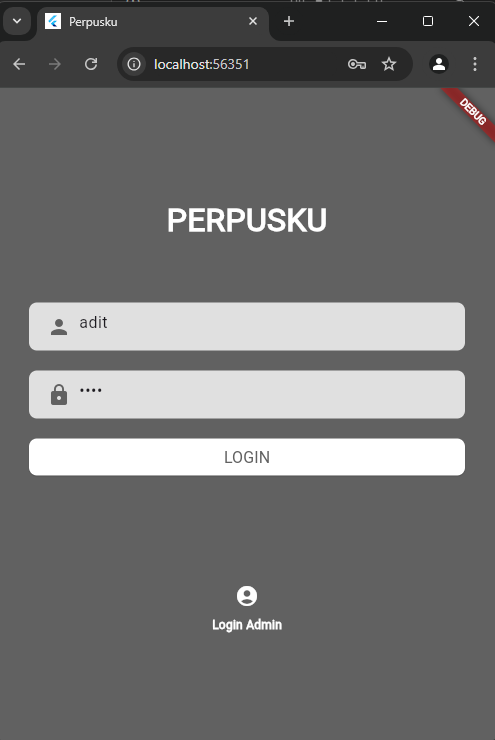

### 🏠 Home Screen

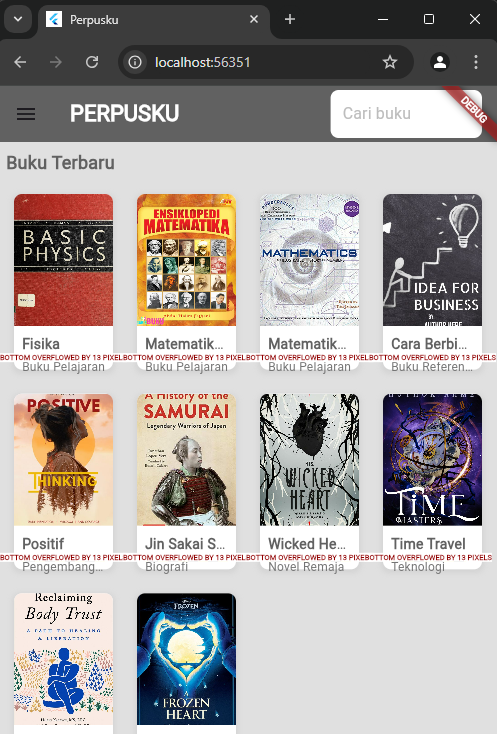

### 📚 Sidebar Navigation

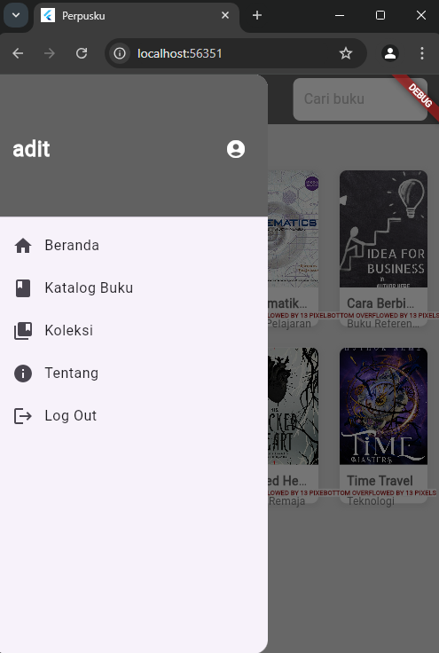

### 🔎 Book Search

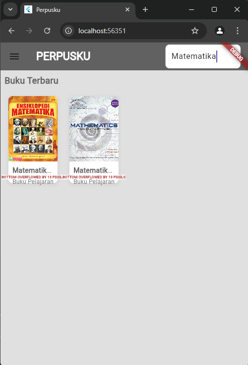

### 📖 Book Details

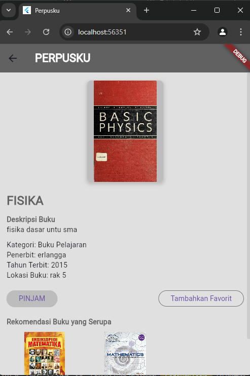

### 📕 Read Book

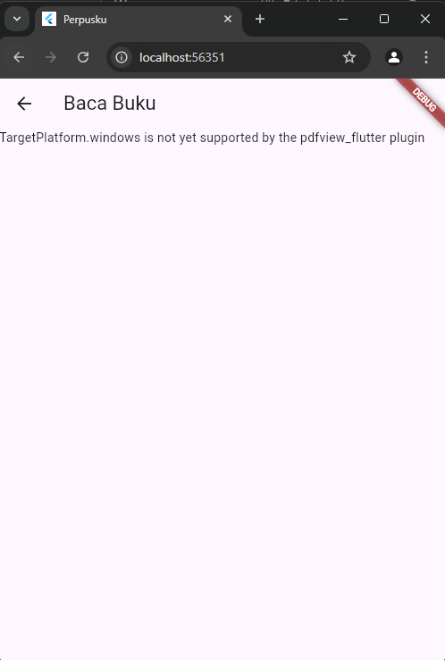

### 🗂️ Catalog

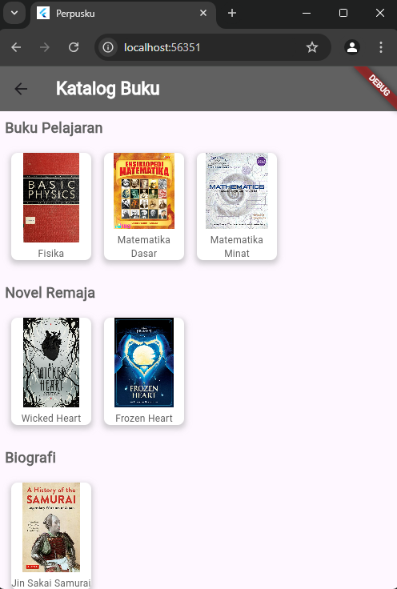

### ❤️ Favorite Books

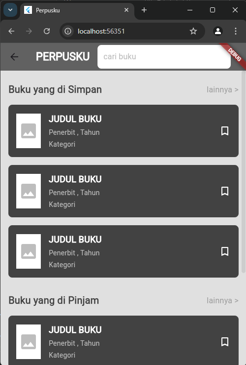

### 🕒 Reading History

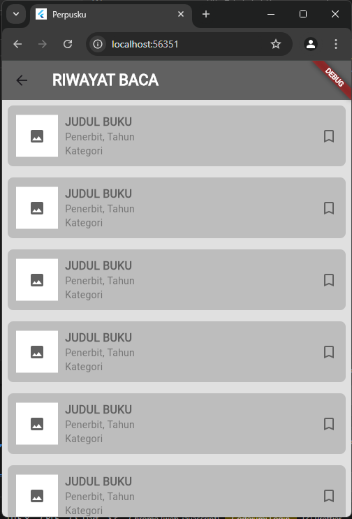

### 👤 User Profile

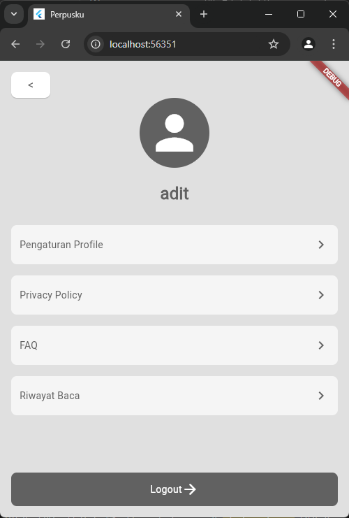

### ❓ Frequently Asked Questions (FAQ)

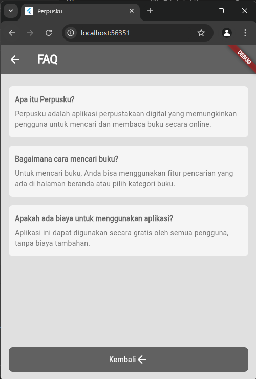

---

## 🛠️ Built With

- Flutter
- Dart
- Material Design
- Object-Oriented Programming (OOP)

---

---

## 🎓 Academic Information

**Course:** Object-Oriented Programming (OOP)

**Project Type:** Semester Final Project

**Year:** 2024

**University:** Universitas Duta Bangsa Surakarta

---

## 👥 Team Members

- Adit Ramadan
- Nabil Dzaka Fahrizal Santoso
- Abdullah Azza Al Abbas

---

## 🔗 Project Links

### Source Code

https://github.com/AditRamadan/Kelompok12_Perpusku

### Presentation Video

https://youtu.be/8-MRAfMksF8

---

⭐ This project was created for educational purposes and serves as a portfolio project demonstrating Flutter development and Object-Oriented Programming concepts.

# class_perpusku

A new Flutter project.

## Getting Started

This project is a starting point for a Flutter application.

A few resources to get you started if this is your first Flutter project:

- [Lab: Write your first Flutter app](https://docs.flutter.dev/get-started/codelab)
- [Cookbook: Useful Flutter samples](https://docs.flutter.dev/cookbook)

For help getting started with Flutter development, view the
[online documentation](https://docs.flutter.dev/), which offers tutorials,
samples, guidance on mobile development, and a full API reference.
